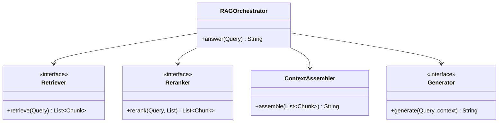

# RAG Orchestrator

**Track:** Gen AI LLD  
**Companies:** OpenAI, Anthropic, Google  
**Difficulty:** Hard  

---

## 1. Problem Statement

Design an in-process RAG (Retrieval-Augmented Generation) orchestrator that accepts a user query, retrieves relevant document chunks, optionally reranks them, assembles context, and generates an answer via an LLM provider interface.

---

## 2. Clarifying Questions

| # | Question | Expected answer |
|---|----------|-----------------|
| 1 | Distributed or in-process? | In-process object model; vector DB is HLD |
| 2 | Swappable components? | Yes — Retriever, Reranker, Generator as interfaces |
| 3 | Streaming? | Optional extension via StreamAggregator |
| 4 | Safety filters? | Extension — GuardrailChain on input/output |
| 5 | Multi-tenant? | Optional tenantId in Query context |

---

## 3. Functional & Non-Functional Requirements

**Functional:**
- `answer(query)` → retrieve → rerank → assemble context → generate
- Pluggable retriever (keyword, vector stub)
- Token budget awareness before generation

**Non-Functional:**
- Open-Closed at each pipeline stage
- Testable with mock Retriever/Generator
- Clear boundary to [HLD RAG](../../System%20Design%20-%20High%20Level%20Design/02-genai-llm-hld/questions/Q02-rag-document-qa.md)

---

## 4. Core Entities & Relationships

| Entity | Role |
|--------|------|
| `RAGOrchestrator` | Pipeline coordinator |
| `Retriever` | Fetch candidate chunks |
| `Reranker` | Score and order chunks |
| `ContextAssembler` | Build prompt context string |
| `Generator` | LLM completion interface |
| `Query` | User question + metadata |
| `RetrievedChunk` | Text + score + source |

---

## 5. Class Diagram



---

## 6. Public API / Key Methods

```java
public class RAGOrchestrator {
    public String answer(Query query);
}
```

---

## 7. Design Patterns & SOLID

| Pattern | Application |
|---------|-------------|
| Chain of Responsibility | Pipeline stages |
| Strategy | Swap retriever, reranker, generator |

**D:** Orchestrator depends on interfaces, not OpenAI/Anthropic concretions.

---

## 12. Interview Answer Script (15 min)

> "I'll model RAG as a pipeline of interfaces — Retriever, Reranker, ContextAssembler, Generator — coordinated by RAGOrchestrator."
>
> "answer() retrieves chunks, reranks, assembles context within token budget, then calls Generator."
>
> "Each stage is swappable for A/B tests or provider changes — Strategy at every step."
>
> "In-process only; at scale I'd add vector DB, embedding service, GPU inference — that's HLD Q02."

---

## 14. Related Links

- [Gen AI LLD Memory Map](../memory-map-genai-lld.md)
- [Java implementation](../../09-code-implementations/java/genai/rag-orchestrator/) (full)
- [HLD RAG Document Q&A](../../System%20Design%20-%20High%20Level%20Design/02-genai-llm-hld/questions/Q02-rag-document-qa.md)
