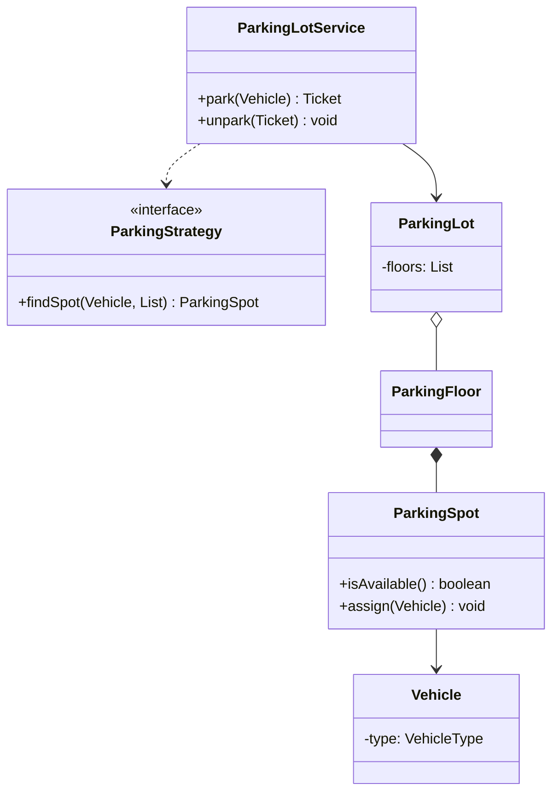
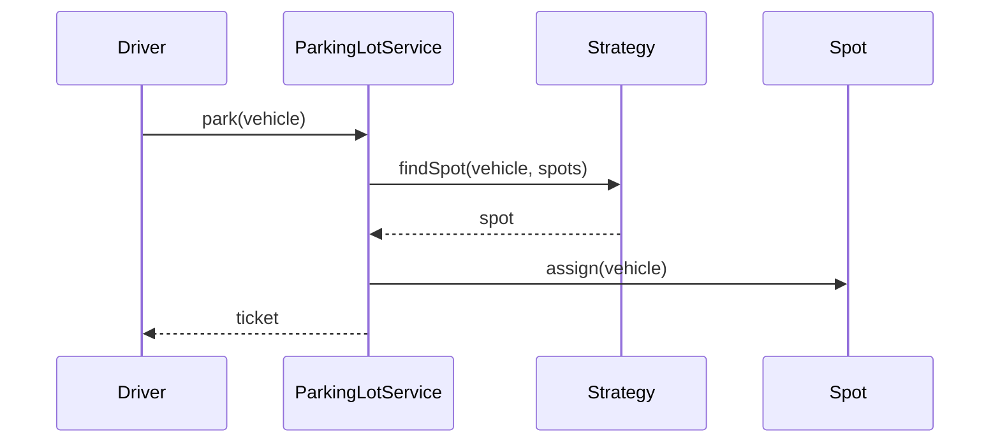
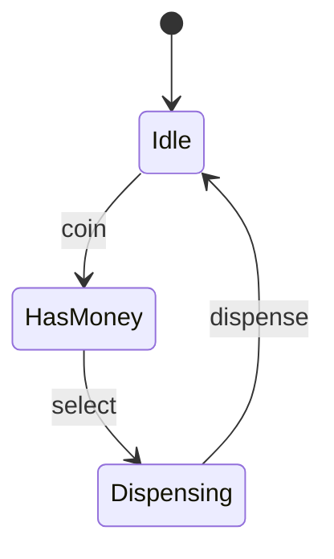

# Mermaid Examples — LLD

---

## classDiagram — Parking Lot

---

## sequenceDiagram — Park Flow

---

## stateDiagram — Vending Machine

---

## Related

- [Class Diagram Templates](class-diagram-templates.md)
