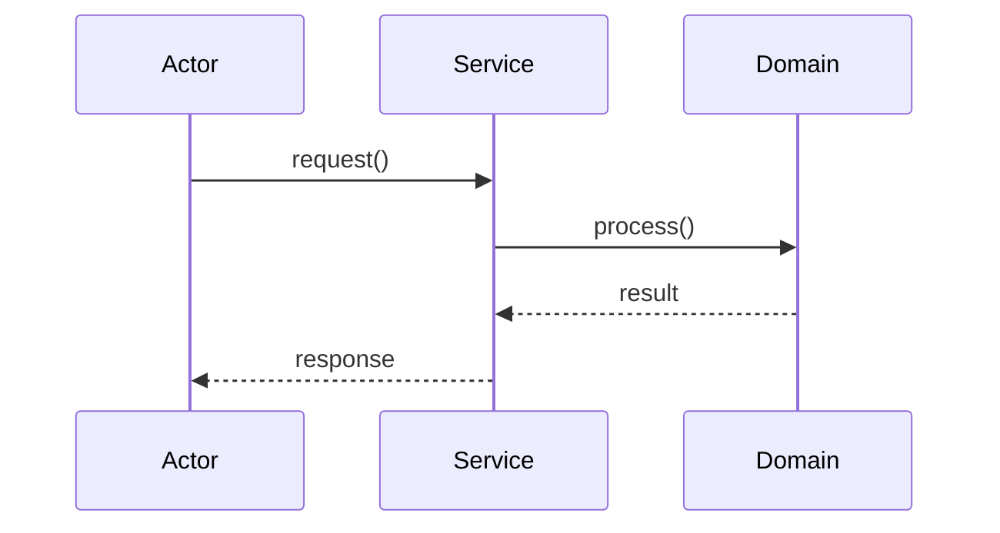

# Sequence Diagram Templates

---

## Template: Happy Path

```
Actor → Service → Domain → Service → Actor
  |--action->|
  |         |--validate/process->|
  |         |<--result---------|
  |<--response-----------------|
```

---

## Template: Failure Path

```
Actor → Service → Domain
  |--action->|
  |         |--check->|
  |         |<--fail--|
  |<--exception/error--|
```

---

## Template: Extension Hook

```
Actor → Service → Strategy (new impl) → Domain
```

Show how swapping Strategy changes flow without editing Service.

---

## Mermaid Skeleton



---

## Related

- [UML Essentials](../01-core-concepts/uml-essentials.md)
