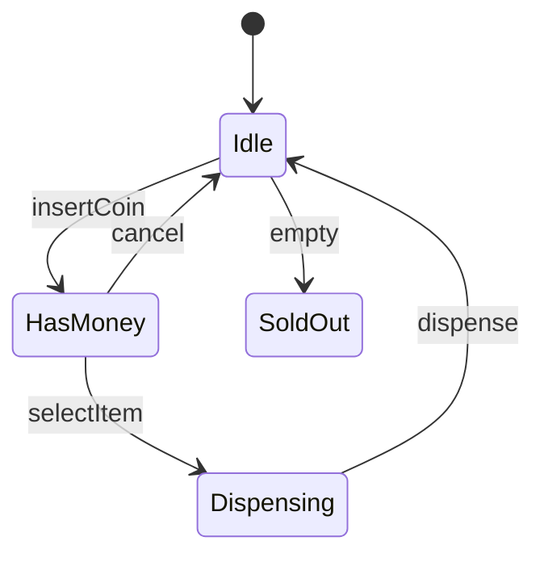
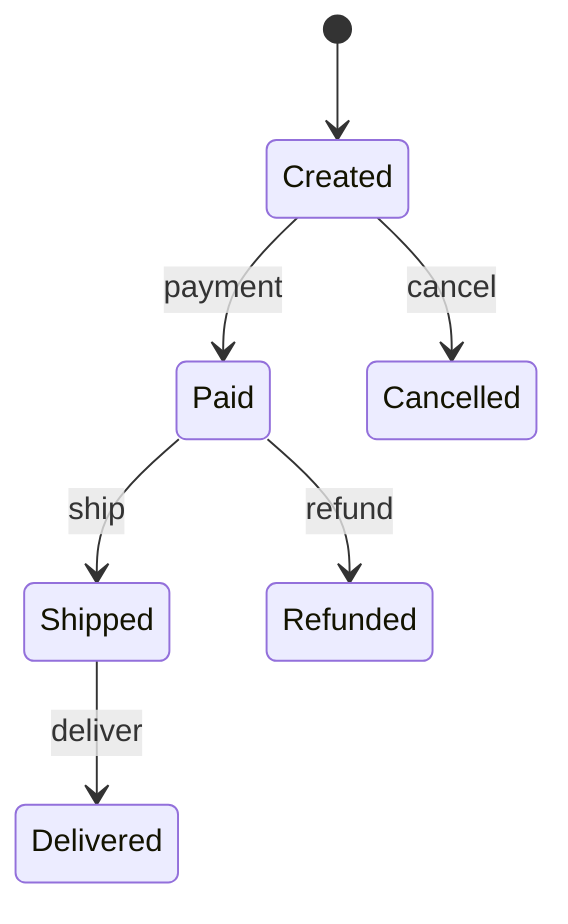
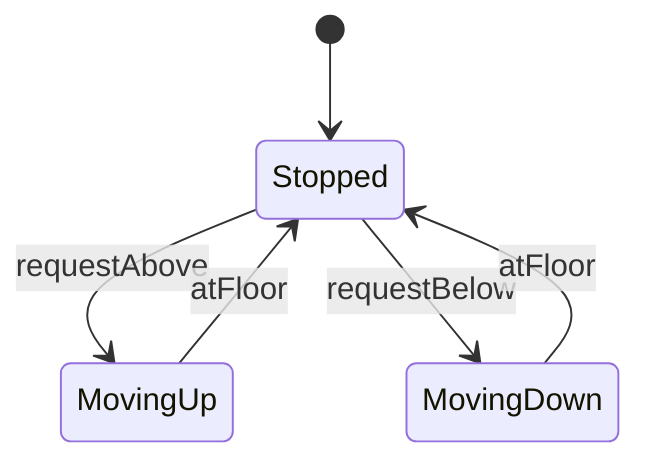

# State Diagram Templates

---

## Vending Machine

---

## Order Lifecycle

---

## Elevator

---

## When Enum Is Enough

| States | Recommendation |
|--------|----------------|
| 2–5, simple transitions | `enum Status` |
| Side effects per transition | State pattern |

---

## Related

- [Pattern Picker](../00-interview-framework/04-pattern-picker.md)
